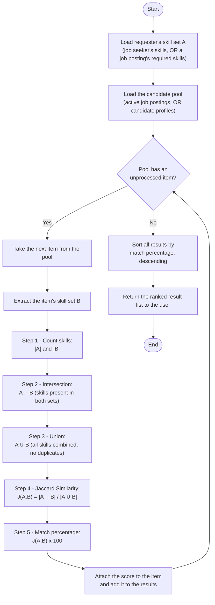

# JobRecommendation Project Overview 
About This Project Technology Use
- Angular (Frontend)
- Asp.Net (Backend)
- MySQL (Database)

## Algorithm Use
- Content-based Recomendation
- Jaccard Similarity

# Job–Candidate Matching Algorithm

**Technique:** Content-based Filtering + Jaccard Similarity
**System:** Job Recommendation Web Application (JobRecommendationDB)

## Overview

The system matches job seekers and job postings using **Content-based Filtering**: it extracts the "Skills" feature from both a job seeker's profile and a job posting, represents each as a set, and measures how well the two sets overlap using the **Jaccard Similarity** coefficient. The same computation is used for both directions the system supports:

- **Job seeker → job postings**: recommend/search postings that best match the job seeker's skill set (functional scope 1.3.1.8).
- **Employer → candidate profiles**: search candidate profiles that best match a job posting's required skills (functional scope 1.3.2.6).

Only the roles of "requirement set" and "candidate set" swap between the two directions — the underlying algorithm is identical, which is what the flowchart below shows.

## Flowchart

## Step-by-step definition

The core of the algorithm (Steps 1–5 in the flowchart) is the Jaccard Similarity coefficient:

$$J(A,B) = \frac{|A \cap B|}{|A \cup B|}$$

where **A ∩ B** is the set of skills common to both sides, and **A ∪ B** is the set of all distinct skills from both sides combined. The result ranges from 0 (no skills in common) to 1 (identical skill sets).

| Step | Description |
|---|---|
| 1 | Enumerate and count the skills in set A and set B. |
| 2 | Find the intersection A ∩ B — the skills that appear in both sets. |
| 3 | Find the union A ∪ B — all skills from both sets, counted once each. |
| 4 | Substitute into the Jaccard equation: divide the intersection count by the union count. |
| 5 | Multiply the result by 100 to express it as an easy-to-read match percentage. |

## Worked example

To illustrate, consider a company posting a sales position that requires 5 skills, and a candidate profile listing 4 skills:

| Variable | Meaning | Skill set | Count |
|---|---|---|---|
| A | Skills the job posting requires | { Product presentation, Negotiation, Driving license, Basic bookkeeping, Microsoft Excel } | 5 |
| B | Skills the candidate has | { Product presentation, Driving license, Customer service, English communication } | 4 |
| A ∩ B | Matching skills | { Product presentation, Driving license } | 2 |
| A ∪ B | All distinct skills combined | { Product presentation, Negotiation, Driving license, Basic bookkeeping, Microsoft Excel, Customer service, English communication } | 7 |

Applying Steps 1–5:

1. \|A\| = 5, \|B\| = 4
2. \|A ∩ B\| = 2
3. \|A ∪ B\| = 7
4. J(A, B) = 2 / 7 ≈ 0.2857
5. 0.2857 × 100 = **28.57%**

**Interpretation:** this candidate is a 28.57% match for the sales position — the score is low because several key required skills (negotiation, bookkeeping, Excel) are missing, even though the candidate offers two matching skills and two additional skills the posting did not ask for.

## Why this technique was chosen

Both a job seeker's skill set and a job posting's required skill set can be represented unambiguously as sets of discrete items, which is exactly the input Jaccard Similarity is designed to compare. It measures overlap directly (no historical interaction data from other users is required, unlike Collaborative Filtering), and its output converts cleanly into a percentage that is easy for both job seekers and employers to interpret at a glance.
